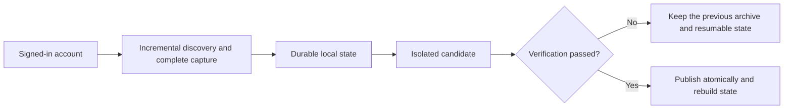

<div align="center">

# Chat History Migration Skills

**Local-first, resumable, and verifiable archives for ChatGPT, Doubao, and Feishu / Lark.**

[](https://agentskills.io)
[](https://www.microsoft.com/windows)
[](https://github.com/yuewithme/chat-history-migration-skills/actions/workflows/validate.yml)
[](./LICENSE)

[中文](./README.md) · [English](./README.en.md)

</div>

> [!IMPORTANT]
> This repository contains Agent Skills, reusable scripts, and public documentation only. It never contains chat content, attachments, credentials, browser sessions, logs, or personal archives.

## Skills

| Skill | Purpose | Highlights |
|---|---|---|
| [ChatGPT Local Backup](./chatgpt-local-backup/SKILL.md) | Preserve conversations, Projects, and files | Selective refresh, resume, SHA-256 deduplication, verified publication |
| [Doubao Local Backup](./doubao-local-backup/SKILL.md) | Preserve complete Doubao conversations and attachments | Deep pagination, attachment recovery, checkpoints, atomic publication |
| [Feishu Personal Data Foundation](./feishu-local-backup/SKILL.md) | Preserve Feishu / Lark chats, documents, and structured data | Multi-tenant identity, stable IDs, policies, tombstones, integrity checks |

All three Skills keep account data local, preserve the last known-good archive on failure, and publish only after verification succeeds.

## Install

Give your Agent the URL of the Skill directory you want to install:

```text
Install this Skill:
https://github.com/yuewithme/chat-history-migration-skills/tree/main/chatgpt-local-backup
```

Replace the final directory with `doubao-local-backup` or `feishu-local-backup` as needed.

## Data flow



## Requirements

- Windows 10 / 11.
- Node.js 24 and a compatible local browser bridge for ChatGPT and Doubao.
- PowerShell plus authenticated `lark-cli` / `lark-*` capabilities for Feishu / Lark.
- A user-selected archive directory outside the Git repository.

See each `SKILL.md` for platform-specific prerequisites, commands, safety boundaries, and stop conditions.

## Security

Never commit exports, chat samples, attachments, cookies, tokens, authorization headers, complete signed URLs, or real API responses. Use synthetic fixtures only. Report vulnerabilities privately as described in [SECURITY.md](./SECURITY.md).

## Release model

This repository is a curated public distribution surface. Daily development happens in private source repositories; milestone snapshots reach `main` only after sanitization, testing, and release validation. Private Git history is never imported here.

## License

[MIT](./LICENSE) © 2026 yuewithme
