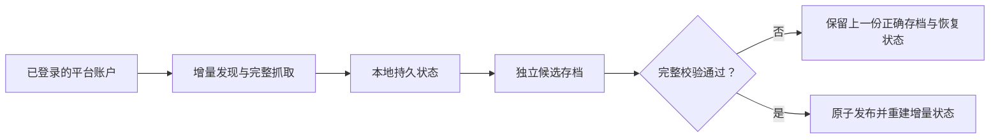

<div align="center">

# 聊天记录迁移 Skills

**把散落在不同平台的个人对话，沉淀为可验证、可恢复、可持续增量维护的本地档案。**

ChatGPT · 豆包 · 飞书 / Lark

[](https://agentskills.io)
[](https://www.microsoft.com/windows)
[](https://github.com/yuewithme/chat-history-migration-skills/actions/workflows/validate.yml)
[](./LICENSE)

[中文](./README.md) · [English](./README.en.md)

</div>

> [!IMPORTANT]
> 本仓库只包含 Agent Skills、通用脚本和公开文档，不包含聊天正文、附件、账户凭据、浏览器会话、运行日志或个人存档。

## 三个 Skill

| Skill | 适合做什么 | 核心能力 |
|---|---|---|
| [ChatGPT 本地备份](./chatgpt-local-backup/SKILL.md) | 维护 ChatGPT 会话、Projects 与文件 | 选择性增量更新、断点恢复、SHA-256 去重、校验后发布 |
| [豆包本地备份](./doubao-local-backup/SKILL.md) | 保存豆包完整会话和附件 | 长对话分页、附件恢复、检查点续跑、原子发布 |
| [飞书个人数据基座](./feishu-local-backup/SKILL.md) | 沉淀飞书 / Lark 聊天、文档和结构化内容 | 多租户、稳定 ID、排除与墓碑、知识价值治理、完整性校验 |

三个 Skill 共享一套底线：**原始数据留在本地，失败不覆盖上一份正确存档，验证通过后才发布。**

它们也共享同一套可移植路径契约：`<ArchiveHome>/<source>/<profile>/`。Skill 不假设 D 盘或当前工作目录；每个 profile 都用 `archive-profile.json` 标记来源和布局版本。完整说明见[统一目录规范](./docs/archive-layout.md)。

## 安装

在 Codex、Claude Code 或其他支持 [Agent Skills](https://agentskills.io) 的工具中，直接提供对应子目录地址。

### ChatGPT

```text
帮我安装这个 Skill：
https://github.com/yuewithme/chat-history-migration-skills/tree/main/chatgpt-local-backup
```

### 豆包

```text
帮我安装这个 Skill：
https://github.com/yuewithme/chat-history-migration-skills/tree/main/doubao-local-backup
```

### 飞书 / Lark

```text
帮我安装这个 Skill：
https://github.com/yuewithme/chat-history-migration-skills/tree/main/feishu-local-backup
```

安装后可以这样触发：

```text
使用 $chatgpt-local-backup 更新并验证我的 ChatGPT 本地备份。
使用 $doubao-local-backup 增量备份我的豆包会话和附件。
使用 $feishu-local-backup 同步并验证我的飞书个人数据基座。
```

## 工作方式



这不是三个一次性导出脚本，而是三条可持续维护的数据管线：

- 新内容增量获取，已有内容按平台可信指纹选择性刷新。
- 原始结构优先，避免为了方便阅读而丢失分支、引用和来源信息。
- 候选区与正式存档隔离，失败时保留可恢复现场。
- 文件使用清单与 SHA-256 校验；可安全去重时按内容去重。
- 凭据只用于当前会话，不写入 Skill、日志或存档。

## 能力边界

| 能力 | ChatGPT | 豆包 | 飞书 / Lark |
|---|:---:|:---:|:---:|
| 会话原始 JSON | ✓ | ✓ | ✓ |
| 增量更新 | ✓ | ✓ | ✓ |
| 附件处理 | ✓ | ✓ | 策略感知 |
| 断点恢复 | ✓ | ✓ | ✓ |
| 候选校验后发布 | ✓ | ✓ | ✓ |
| 多租户 | — | — | ✓ |
| 云文档与结构化数据 | Projects | — | ✓ |
| 删除墓碑 / 阻止重下 | — | — | ✓ |

> [!NOTE]
> 平台接口、登录状态和账号权限会变化。每个 Skill 都会保留无法确认的 gap，而不会把权限失败、超时或空响应伪装成成功。

## 环境要求

- Windows 10 / 11。
- ChatGPT、豆包：Node.js 24，以及可提供当前已登录会话的本地浏览器桥接能力。
- 飞书 / Lark：PowerShell 与已认证的 `lark-cli` / 对应 `lark-*` 能力。
- 足够的本地磁盘空间；真实存档目录由用户显式选择，且不应位于 Git 仓库内。

各平台的详细前置条件、命令和停止条件以对应 `SKILL.md` 为准。

## 仓库结构

```text
chat-history-migration-skills/
├── README.md
├── README.en.md
├── docs/archive-layout.md
├── chatgpt-local-backup/
│   ├── SKILL.md
│   ├── README.md
│   ├── agents/
│   ├── references/
│   ├── scripts/
│   └── LICENSE
├── doubao-local-backup/
└── feishu-local-backup/
```

每个一级目录都是一个可以独立安装的 Skill，并遵守相同的源码骨架；各来源的真实数据布局仍由本目录下的 reference 定义。本仓库的 `main` 分支只接收经过脱敏、测试和完整性检查的阶段性公开版本。

## 隐私与安全

> [!CAUTION]
> 不要把任何导出目录、聊天样本、附件、Cookie、Token、Authorization Header、完整签名 URL 或真实 API 响应提交到 Git。

- 所有账户数据默认只保存在用户选择的本地目录。
- 浏览器凭据存储不是数据源，Skill 不应直接读取它。
- 删除与清理必须先预览精确目标；源平台写操作需要单独授权。
- 测试只能使用合成数据，不使用真实聊天作为 fixture。
- 发现安全问题时，请按 [SECURITY.md](./SECURITY.md) 私下报告。

## 发布方式

这个公开仓库是稳定发布面，不是日常开发仓库。三个 Skill 在各自的私有源仓库中演进；形成阶段性成果后，再经过脱敏审计、测试和发布检查同步到这里。公开仓库不会导入私有 Git 历史。

版本标签按 Skill 独立命名：

```text
chatgpt-v1.0.0
doubao-v1.0.0
feishu-v1.0.0
```

## 贡献

欢迎通过 Issues 提交兼容性问题、数据完整性问题和改进建议。为避免公开发布面与私有开发源分叉，核心改动会先回到对应源项目验证，再进入下一次公开发布。

## License

[MIT](./LICENSE) © 2026 yuewithme

<div align="center">

**你的聊天记录应该可恢复、可验证，也应该始终由你自己保管。**

</div>
