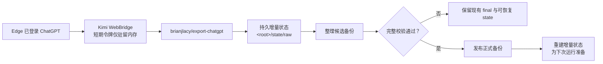

<div align="center">

# ChatGPT 本地存档系统

**JSON 优先 · 增量更新 · 内容去重 · 校验后发布 · 本地隐私保护**

`状态：VERIFIED`　`自动任务：ACTIVE`　`更新策略：SELECTIVE REFRESH`

</div>

> [!IMPORTANT]
> 本仓库只保存 Skill 源码。真实数据位于用户选择的 `<ArchiveHome>/chatgpt/<profile>/`，Skill 不假设盘符。

本仓库是本地 ChatGPT 存档工作区所使用的原始私人 Skill 仓库，只保存可复用流程、脚本与公开安全的项目说明。

## 项目概览

这是“个人 AGI 存档计划”中的 ChatGPT 独立工作区，用于长期维护完整、可恢复、适合 AI 读取的本地历史存档。

| 项目 | 当前状态 |
|---|---|
| 正式备份 | `<root>/final/ChatGPT_Backup` |
| 数据格式 | 原始结构化 JSON |
| 普通与归档会话 | 支持 |
| ChatGPT Projects | 支持 |
| 附件、图片、项目文件 | 支持 |
| 语音听写资源 | 支持 |
| Canvas | 不导出 |
| 内容去重 | SHA-256 |
| 自动更新 | 每周日 10:00（Asia/Shanghai） |
| 发布策略 | 候选完整校验通过后原子替换 |

## 系统流程



### 选择性更新逻辑

| 检测结果 | 行为 |
|---|---|
| 新会话 ID | 下载完整会话 JSON 与新引用文件 |
| 已有 ID，`update_time` 变化 | 重新下载并替换该会话的完整 JSON |
| 已有 ID，`update_time` 未变化 | 跳过，不重复下载 |
| 新附件或文件 ID | 补充下载 |
| 文件内容重复 | 发布时按 SHA-256 合并为一个物理文件 |
| 运行中断或令牌过期 | 保留状态，下次从进度继续 |

> [!NOTE]
> 会话更新采用“完整替换单条 JSON”，而不是消息级拼接。这样可以正确保留对话分支、重新生成、删除和附件引用变化。

## 目录结构

### Skill 源码：可发布能力

```text
chatgpt-local-backup/
├── SKILL.md                        # Agent 的执行入口与强制流程
├── README.md                       # 面向人的安装、目录和使用说明
├── agents/openai.yaml              # Skill 列表中的名称、简介和默认提示
├── scripts/                        # 初始化、采集、整理、校验和发布脚本
├── references/                     # 目录契约与保留策略
├── LICENSE
└── .gitignore
```

### 存档区：真实账户数据

```text
<ArchiveHome>/chatgpt/<profile>/
├── archive-profile.json            # 来源、档案 ID 和布局版本；不写绝对路径
├── final/ChatGPT_Backup/            # 当前已发布、已验证的正式备份
│   ├── conversations\regular\
│   ├── conversations\projects\
│   ├── attachments\files\
│   ├── attachments\manifest.json
│   └── metadata\
├── state/raw/                       # 可恢复的持久增量状态
├── tool/export-chatgpt/             # 上游导出工具
├── working/                         # 临时候选与受控中间文件
├── logs/
└── reports/
```

## 数据与验证

正式备份以以下文件为最终事实来源：

- `metadata/final-verification.json`：最终通过/失败状态。
- `metadata/conversation-index.json`：会话索引与存储路径。
- `metadata/project-index.json`：Project 元数据。
- `attachments/manifest.json`：文件 ID、SHA-256、引用关系和实际路径。
- `metadata/export-report.json`：导出数量、失败项和警告。
- `metadata/dedup-report.json`：内容去重结果。

### 最近验证快照

> 核对日期：2026-08-15；数据导出时间：2026-08-13。

| 指标 | 结果 |
|---|---:|
| 会话 | 18 |
| Project 会话 | 0 |
| 引用文件 ID | 47 |
| 去重前保留文件 | 46 |
| 去重后物理文件 | 44 |
| 去重后附件体积 | 9,568,454 bytes |
| 显式排除的生成图片 | 1 |
| JSON 哈希不一致 | 0 |
| 缺失清单文件 | 0 |
| 未解释引用 | 0 |
| JWT 形态命中 | 0 |
| 最终校验 | **PASSED** |

这些数字会随备份更新。判断当前状态时，以 `final-verification.json` 和最新运行报告为准。

## 安全边界

> [!CAUTION]
> 不要把任何 `<ArchiveHome>`、浏览器凭据、Bearer Token、附件、日志或导出 JSON 提交到 GitHub。

- 复用 Edge 登录状态，但不读取浏览器凭据存储。
- ChatGPT 访问令牌只在当前进程内存中使用，不落盘、不打印、不提交。
- 授权头只允许发送到 HTTPS 的 `chatgpt.com` 及其子域名。
- 外部签名附件 URL 不携带 ChatGPT 授权头。
- 永久聊天正文只保存 JSON；默认不生成 Markdown、HTML、PDF、TXT、JSONL 或 ZIP 副本。
- 仅当元数据明确标记为 DALL-E/图片生成时排除图片；来源未知的图片默认保留。
- 候选备份校验失败时，不替换当前正式备份。

## 如何使用

先在任意本地磁盘选择一个统一存档家目录，再初始化稳定档案 ID：

```powershell
$archiveHome = 'E:\ChatHistoryArchive' # 示例，可换盘符或挂载点
node scripts\init-backup.js --archive-home $archiveHome --profile primary
node scripts\run-raw-export.js --archive-home $archiveHome --profile primary
```

已有旧存档无需搬迁；核对后用 `--root <旧路径> --profile <id> --adopt-existing` 写入可移植标记。

### 让 Codex 执行维护

1. 以本目录作为工作目录打开任务。
2. 确认 Edge 已登录目标 ChatGPT 账户，Kimi WebBridge 可用。
3. 明确调用项目 Skill：

   ```text
   使用 $chatgpt-local-backup 更新并验证我的 ChatGPT 本地备份。
   ```

4. 查看运行报告和 `metadata/final-verification.json`，确认发布是否成功。

### 自动任务

- 名称：`每周增量备份 ChatGPT`
- 任务 ID：`chatgpt`
- 周期：每周日 10:00（Asia/Shanghai）
- 运行条件：电脑开机、Codex 桌面端运行、Edge 登录有效、Kimi WebBridge 可用。
- 失败策略：不破坏已发布备份，保留增量状态并报告原因。

## 关键文档

- [ChatGPT 本地备份 Skill](./SKILL.md)
- [目录与保留策略](./references/layout-and-policy.md)
- [Skill 私人仓库](https://github.com/yuewithme/chatgpt-local-backup-skill)

## 当前版本

| 组件 | 版本/提交 |
|---|---|
| 选择性刷新功能基线 | `cd5b72b` |
| 上游导出器 | `4cfc3f235ad41c864e7fe2369fb0037875537dbd` |
| 自动任务 | `ACTIVE` |

---

<div align="center">

**目标：让 ChatGPT 历史长期可验证、可恢复、可继续增量更新，同时始终留在本地。**

</div>
