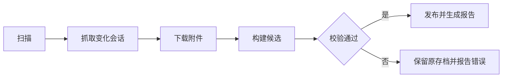

<div align="center">

# 🫘 Doubao Local Backup

豆包聊天记录的本地增量备份 Skill

[](https://github.com/yuewithme/doubao-local-backup-skill/actions/workflows/ci.yml)


</div>

## 功能

| | |
|---|---|
| 🔎 增量扫描 | 发现新增、变化和失败待续项 |
| 💬 完整会话 | 抓取变化会话的全部消息 |
| 📎 附件下载 | 保存、校验并去重附件 |
| ♻️ 断点续跑 | 中断后从检查点继续 |
| ✅ 校验发布 | 候选通过校验后再替换最终存档 |
| 📊 结果报告 | 成功或失败时输出脱敏 HTML |

## 使用

要求：Windows、Node.js 24、Kimi WebBridge，以及已登录豆包的浏览器页面。

先选择统一存档家目录；不同电脑可以使用不同盘符，但相对结构保持一致：

```powershell
$archiveHome = 'E:\ChatHistoryArchive' # 示例
node scripts/init-backup.js --archive-home $archiveHome --profile primary
```

运行备份：

```powershell
node scripts/run-auto-backup.js --archive-home $archiveHome --profile primary
```

完整扫描远端列表：

```powershell
node scripts/run-auto-backup.js --archive-home $archiveHome --profile primary --complete-listing
```

也可以始终显式传 `--root <profile-root>`。Skill 不再默认使用某个盘符；已有旧存档核对后可通过 `init-backup.js --root <旧路径> --profile <id> --adopt-existing` 原地登记，无需搬迁。

## 目录规范

```text
<ArchiveHome>/doubao/<profile>/
├── archive-profile.json       # 来源、profile、布局版本和相对路径
├── state/raw/                 # 可恢复的增量状态
├── working/                   # 临时下载与候选
├── final/Doubao_Backup/
│   ├── conversations/         # 聊天记录 JSON
│   ├── attachments/files/     # 原始文件
│   └── metadata/              # 清单与校验 JSON
├── documents/                 # Markdown 文档 .md
├── reports/                   # 脱敏运行报告
├── logs/                      # 脱敏日志
└── tool/                      # 锁与可重建工具缓存
```

聊天记录统一使用 JSON，文档统一使用 Markdown。`documents/` 不随正式备份发布而替换。

## 主链路



| 状态 | 结果 |
|---|---|
| `unchanged` | 无变化，直接结束 |
| `completed` | 备份和验证完成 |
| `action_required` | 保留进度和原存档，等待重试 |

## 常用维护

```powershell
# 重试失败附件
node scripts/repair-existing-attachments.js --root <profile-root>

# 检查增量状态
node scripts/diagnose-incremental.js --root <profile-root>

# 验证最终存档
node scripts/verify-backup.js --input <profile-root>\final\Doubao_Backup
```

结果位置：

```text
<profile-root>\final\Doubao_Backup
<profile-root>\reports\latest-result.html
<profile-root>\reports\latest.html
```

## 约束

- 只调用豆包只读接口。
- 不持久化 Cookie、Token、请求头或签名 URL。
- 不因单次远端列表缺失删除本地会话。
- 校验失败时不覆盖已有存档。

详细契约：

- [采集](references/capture-contract.md)
- [存储](references/layout-and-policy.md)
- [验证](references/verification-policy.md)
- [报告](references/reporting.md)

## 测试

```powershell
Get-ChildItem .\scripts -Recurse -Filter *.js | ForEach-Object { node --check $_.FullName }
node --test .\scripts\tests\archive-core.test.js .\scripts\tests\monitoring.test.js
```

## License

[MIT](LICENSE)
