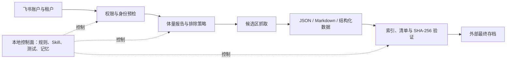
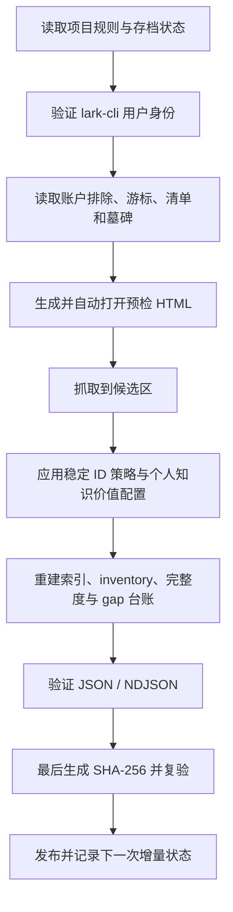

# 飞书个人数据基座 Skill

> 将用户有权访问的飞书 / Lark 数据，持续沉淀为可追溯、可增量、可验证、适合 AI 使用的私人数据基础设施。

`feishu-local-backup` 只保存可复用的 Skill、脚本、测试和参考文档；真实账户数据始终保存在仓库外部。

| 项目 | 说明 |
|---|---|
| Skill | `feishu-local-backup` |
| 平台 | Windows PowerShell、Codex、`lark-cli` |
| 存档位置 | `<ArchiveHome>/feishu/<profile>/`，或显式 `-ArchiveRoot` |
| 权威聊天格式 | JSON |
| 权威文档格式 | Markdown + JSON 元数据 |

## 项目目标

这个项目不是一次性下载脚本，也不是把飞书里的所有文件无差别搬到硬盘。它要建立一条可以长期重复运行的数据管线：

1. 识别当前登录账户、租户和实际权限。
2. 在下载前展示聊天、消息和附件体量。
3. 只抓取用户有权访问的数据。
4. 保持聊天、文档和结构化对象的关键语义与来源信息。
5. 记住账户级排除、删除墓碑、同步游标和历史完成状态。
6. 经过结构、引用、清单和 SHA-256 验证后再发布。
7. 为未来个人 AI / AGI 提供稳定、可组合的数据底座。

> **核心原则：** 数据先保真，知识再治理；不因当前价值较低就自动删除，也不因“能够下载”就默认保存所有大附件。

## 双层架构



| 层级 | 保存内容 | 明确不保存 |
|---|---|---|
| 工作区控制面 | Skill 源码、测试、规则、施工方案、短记忆 | 聊天正文、文档正文、附件、Cookie、令牌、授权链接 |
| 外部数据面 | JSON、Markdown、结构化导出、必要附件、报告、索引、运行状态、哈希 | Git 开发历史和临时开发文件 |
| Codex 运行镜像 | 可被 Codex 自动发现的 Skill 运行文件 | Skill 的权威开发历史 |

## 目录结构

```text
feishu-local-backup/
├── SKILL.md                           # Agent 工作流入口
├── README.md                          # 面向人的安装、结构与使用说明
├── agents/openai.yaml                 # Skill 界面元数据
├── references/                        # 结构、策略和运行契约
└── scripts/                           # 初始化、同步、报告、维护与测试

<ArchiveHome>/feishu/<profile>/
├── archive-profile.json               # 来源、稳定档案 ID 和布局版本；不含绝对路径
├── _meta/                              # 清单、状态、策略、报告、运行与哈希
├── chats/                              # 权威消息 JSON、成员、附件和隔离区
├── drive/                              # Drive 原始清单、文档、元数据、结构化数据和文件
├── wiki/                               # Wiki 原始清单、文档、元数据、结构化数据和文件
└── calendar|meetings|tasks|.../        # 按需启用的结构化协作域
```

> `ArchiveHome` 可以在任意盘符或挂载点；绝对路径不写进 Skill。所有真实操作都必须显式解析档案根目录并校验 `archive-profile.json`。

## 数据格式契约

| 数据类型 | 权威格式 | 处理规则 |
|---|---|---|
| 聊天消息 | JSON | 保留消息 ID、会话 ID、发送者、时间、类型、回复、线程、反应和资源引用 |
| 聊天 Markdown | 派生视图 | 仅在需要喂给 AI 时生成，不替代原始 JSON |
| 云文档 | Markdown + JSON 元数据 | Markdown 保存正文；JSON 保存稳定 ID、知识库路径、来源、作者、时间和权限信息 |
| Sheets / Base | 结构化 JSON，必要时 CSV | 不为了统一成 Markdown 而丢失表格结构 |
| PDF / PPT / DOCX / 图片 | 支撑性源文件 | 先提取知识，再按个人价值、可恢复性和存储成本决定是否保留二进制文件 |
| 音频 / 视频 | 支撑性源文件 | 优先提取字幕、转写和元数据；大文件必须先预检 |
| 附件删除 | JSON 墓碑 | 删除后记录稳定资源键、原路径、大小、SHA-256，并阻止未来重下 |

## 标准运行流程



聊天预检 HTML 固定包含四张 Top 10 表：

- 群聊附件大小前十
- 群聊消息条数前十
- 私聊附件大小前十
- 私聊消息条数前十

附件排行支持查看详情，默认展开前 20 条。删除按钮连接真实的本地后端，只监听 `127.0.0.1`，并要求每次启动生成的临时令牌。

## 快速开始

### 1. 进入 Skill 目录并初始化档案

```powershell
$skillRoot = '<path-to-feishu-local-backup>'
$archiveHome = 'E:\ChatHistoryArchive' # 示例，可换盘符或挂载点
$profileId = 'primary'
$archiveRoot = Join-Path $archiveHome "feishu\$profileId"
Set-Location -LiteralPath $skillRoot
.\scripts\initialize_archive.ps1 -ArchiveHome $archiveHome -ProfileId $profileId
```

已有旧存档无需移动；检查确认后运行 `initialize_archive.ps1 -ArchiveRoot <旧路径> -ProfileId <id> -AdoptExisting` 写入统一标记。

### 2. 只读检查当前存档

```powershell
.\scripts\archive_maintenance.ps1 -Action Status -ArchiveRoot $archiveRoot
.\scripts\archive_maintenance.ps1 -Action ValidateJson -ArchiveRoot $archiveRoot
.\scripts\archive_maintenance.ps1 -Action VerifyHashes -ArchiveRoot $archiveRoot -FullHash
```

### 3. 验证飞书登录身份

```powershell
lark-cli auth status --json --verify
```

必须使用已验证的用户身份处理个人资源。不得静默切换到 Bot，也不得把令牌、设备码或授权链接写进日志或项目文件。

### 4. 同步全部核心内容

聊天、Drive、Wiki、云文档、Sheet、Base、Slides、Mindnote 和普通文件清单使用统一入口：

```powershell
.\scripts\sync_feishu_all.ps1 `
  -ArchiveRoot $archiveRoot `
  -Mode Incremental `
  -ContentMode Knowledge
```

`Knowledge` 会完整盘点稳定 ID，聊天保存 JSON，文档保存 Markdown + JSON 元数据，Sheet/Base/Slides 保存结构化或原生快照；普通二进制默认只登记并进入策略审查。只有确认存储策略后才使用 `KnowledgeAndBinaries`。

#### 仅同步聊天 JSON

首次完整抓取：

```powershell
.\scripts\sync_feishu_messages.ps1 `
  -ArchiveRoot $archiveRoot `
  -Mode Full `
  -ThreadMode All
```

日常增量抓取：

```powershell
.\scripts\sync_feishu_messages.ps1 `
  -ArchiveRoot $archiveRoot `
  -Mode Incremental `
  -ThreadMode Discovered
```

消息同步只保存权威 JSON 和资源引用，不批量下载附件。附件下载属于单独的策略感知阶段。

### 5. 修改 Skill 后同步 Codex 运行镜像

```powershell
.\scripts\sync_installed_skill.ps1 -Action Install
.\scripts\sync_installed_skill.ps1 -Action Check
```

`Check` 会比较项目源码与 Codex 运行镜像的相对路径和 SHA-256；只有完全一致才返回成功。

### 6. 运行回归测试

```powershell
.\scripts\test_sync_feishu_messages.ps1
```

当前回归覆盖：全量同步、增量合并、账户级排除、失败时保留上一份正确数据、gap 持久化与恢复、历史覆盖完整性、防止虚假完成状态、最终哈希验证。

## 账户级排除

通用 Skill 的默认排除表保持为空。真实排除策略按登录用户保存：

```text
<archive>/_meta/policies/accounts/<open_id>/chat_exclusions.json
```

添加或替换一个账户级会话排除：

```powershell
.\scripts\set_account_chat_exclusion.ps1 `
  -ArchiveRoot $archiveRoot `
  -AccountKey '<verified-open-id>' `
  -ChatId '<chat-id>' `
  -Disposition purge `
  -Scope messages,members,attachments,future_downloads `
  -Reason '<explicit-user-decision>'
```

该命令只更新策略。对已经存在的本地数据进行删除或隔离时，仍需先运行对应脚本的预览模式，再根据用户明确授权执行。

## 安全边界

> [!IMPORTANT]
> 真实聊天、文档、附件、API 响应和账户凭据永远不得提交到 GitHub。

- 飞书源端默认只读；除非用户单独要求，不修改源端消息、文档或文件。
- 只处理当前用户有权访问的数据，权限失败必须记为 gap，不能伪装成空数据。
- 不用标题猜测身份、租户或删除目标，优先使用稳定 ID。
- 不用文件名、扩展名或体积单独决定知识价值。
- 不覆盖上一份正确原始响应；失败结果写入本次运行记录。
- 不在验证完成前标记归档完成。
- SHA-256 必须是最终文件变更，之后若再修改任何存档文件，必须重新计算并复验。
- 删除附件前必须从当前活动清单解析目标，拒绝绝对路径、目录逃逸和重解析点。
- 新增附件下载器时，必须在每一次网络请求前检查删除墓碑。

## 当前能力与下一阶段

| 能力 | 状态 | 说明 |
|---|---|---|
| 项目与真实数据双层隔离 | 已完成 | 工作区不包含账户原始数据 |
| 账户级聊天排除 | 已完成 | 默认不重复抓取明确排除的会话 |
| 聊天 JSON 全量 / 增量同步 | 已完成 | 支持线程、重叠窗口和稳定 ID 合并 |
| 四表聊天预检报告 | 已完成 | 生成后自动打开 |
| 交互式附件删除 | 已完成 | 真实后端、墓碑、inventory 和哈希闭环 |
| JSON / NDJSON / SHA-256 验证 | 已完成 | 验证失败不留下虚假完成状态 |
| 知识库与云文档统一管线 | 已实现，待在线烟雾测试 | Drive/Wiki 递归盘点、Markdown、Mindnote、Sheet/Base/Slides 快照 |
| 策略感知附件下载器 | 部分完成 | 普通文件已有排除、大小和未知体积门禁；文档内嵌资源仍需继续接入统一墓碑检查 |
| 每个账户/租户的在线烟雾测试 | 按需执行 | 先小范围预检，再扩大增量范围 |

## 文档导航

- [Skill 入口](./SKILL.md)：可复用执行工作流
- [归档结构规范](./references/archive-schema.md)：目录、索引、策略与完整性语义
- [运行手册](./references/runbook.md)：各域抓取和发布顺序
- [全域覆盖矩阵](./references/full-backup-matrix.md)：完整备份的域、格式和验收门槛
- [个人价值治理](./references/personal-data-foundation.md)：个人数据基座的价值判断边界
- [个人知识配置模板](./references/personal-knowledge-profile.template.json)：账户或租户专属的价值判断配置

## 给后续 AI 的接手顺序

1. 先读本 README，理解控制面与数据面的边界。
2. 再读 `SKILL.md`，按路由加载与本次任务直接相关的 references。
3. 在个人迁移工作区执行时，继续读取当地的 `AGENTS.md` 和 `ARCHIVE_MEMORY.md`，确认真实路径、账户和状态。
4. 先预检、后抓取；先验证、后发布；任何私人数据都不进入 Git。

---

本项目服务于个人数据基座建设：保留可追溯的数据真相，让未来的 AI 可以在不依赖当前聊天上下文的情况下继续理解、组合和维护这些资料。
